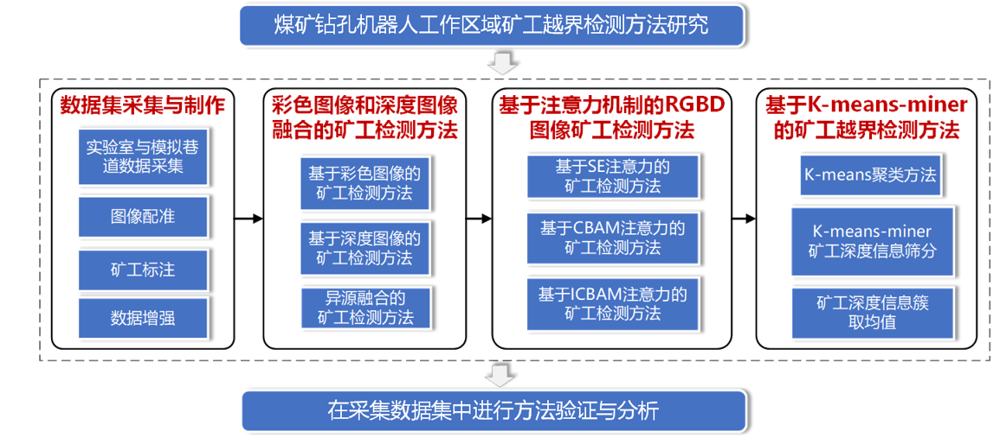
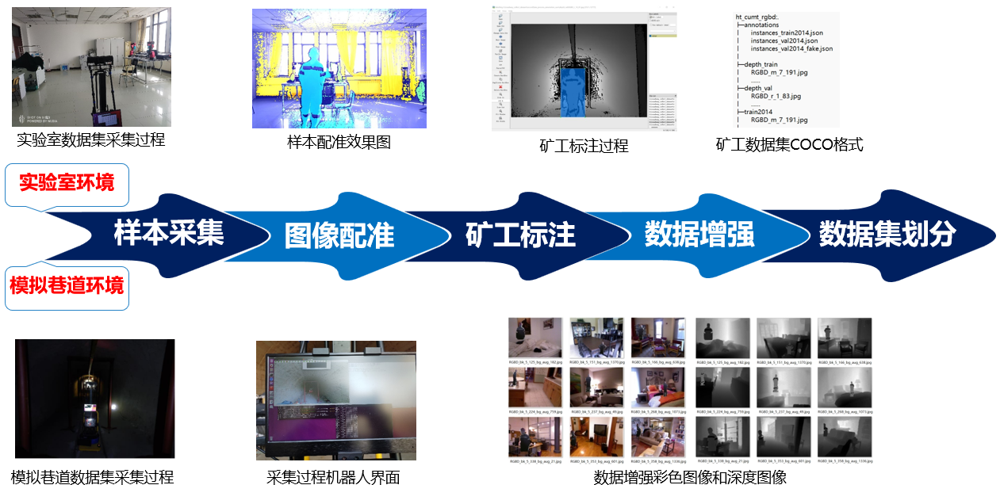

# ht_miner_cross-border_detection
Research on Miner Cross-border Detection within Drilling Robot Working Area in Underground Coal Mine
# 毕设框架

# 算法演示

# 相关代码
- [矿工检测算法](https://github.com/HT-hlf/YOLOv3-RGBD-ICBAM.git)
  - [Train version](https://github.com/HT-hlf/mmdetection_miner-2.22.0.git)
  - [Test version](https://github.com/HT-hlf/mmdetection_miner-2.22.0-predict.git)
- [矿工距离计算](https://github.com/HT-hlf/matlab_coursework.git)
- [数据集处理](https://github.com/HT-hlf/rgbd_dataset_process.git)
- [RGBD数据增强](https://github.com/HT-hlf/rgbd_agumentation.git)
- [Ros上RGBD图像的数据集采集包](https://github.com/HT-hlf/ht_save_rgbd_from_kinect2.git)

